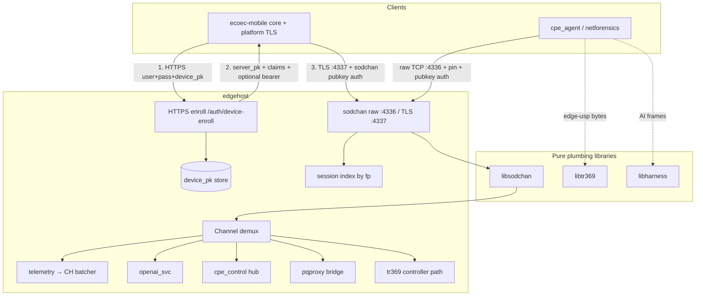
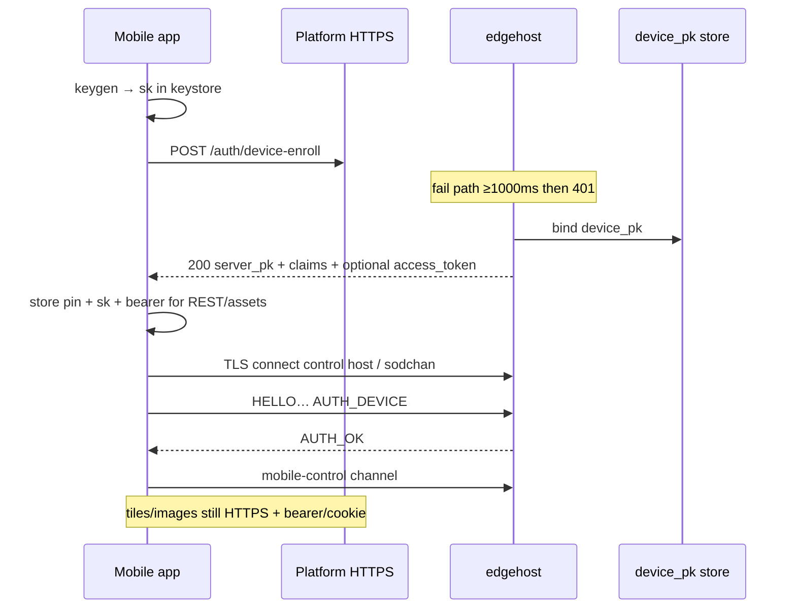

# Design: libsodchan — libsodium Multiplexed Channel Transport (CPE Call-Home & Mobile)

| Field | Value |
|-------|-------|
| **Document** | libsodchan design — libsodium SSH-like transport replacing libchssh for CPE + mobile |
| **Author** | (unassigned) |
| **Date** | 2026-08-02 |
| **Status** | Draft (rev 0.3 — re-review response) |
| **Audience** | Platform maintainers, sibling-library owners, edgehost / netforensics / ecoec-mobile implementers |
| **Primary new repo** | `/home/dwhite/libsodchan` |
| **Consumers** | `~/edgehost`, `~/netforensics` (`cpe_agent`), `~/ecoec-mobile`, optionally `~/edge-web` (channel contracts only) |
| **Replaces (paths)** | libchssh usage for **CPE call-home** and (future) **mobile control plane** |
| **Does not replace** | libchssh for **E7 / multi-vendor NETCONF Call Home** (RFC 8071, OpenSSH interop, Calix identity) |
| **Related** | `~/libsodium_design.txt`, `~/libchssh/ARCHITECTURE.md`, `~/edgehost/docs/designs/cpe-ssh-callhome.md`, `~/edgehost/docs/guides/mobile-bearer.md`, `~/edge-platform-program-design.md`, `~/docs/edge-interface-redesign-design.md` |

---

## Overview

This design proposes **libsodchan**: a pure-C, syscall-free, callback-free state-machine library that provides an **SSH-like session model** (versioned hello, key exchange with **mandatory server identity proof**, device pubkey authentication, multiplexed named channels, flow control, disconnect) over a **fixed libsodium crypto stack**. It inherits the sibling plumbing contract (`*_create` / `*_feed_input` / `*_get_output` / `*_next_event`) used by libchssh, libnetconf, librest, libtr369, and libharness.

libsodchan **functionally replaces libchssh** for:

1. **CPE agent call-home** (`netforensics` `cpe_agent` ↔ edgehost `cpe_callhome`) — telemetry, AI, control, PG, USP, staff reverse channels. Legacy chssh path listens on **:4335**; sodchan default **:4336**.
2. **Mobile app control plane** (`ecoec-mobile` employee + customer) — after HTTPS enrollment, long-lived pubkey-authenticated sessions carrying control/data traffic except images and static page assets (those remain HTTPS, often with a coexisting bearer/cookie).

It deliberately **does not** replace libchssh for **NETCONF Call Home** (`e7_callhome` / port 4334, Calix identity XML, OpenSSH-compatible KEX, subsystem `netconf`). That path requires wire interop with field gear and stays on the existing SSH stack.

Motivation is **efficiency and memory savings** on CPE (OpenWrt / IPQ) and mobile: drop OpenSSH-shaped negotiation and multi-backend RSA/DH/AES-CTR plumbing in favor of a single modern AEAD + X25519 + Ed25519 stack via libsodium. Size wins must be measured against **both** OpenSSL (host) and **mbedTLS** (field CPE backend); see §8.

---

## Background & Motivation

### Current state

| Surface | Transport today | Auth | Library |
|---------|-----------------|------|---------|
| E7 / OLT NETCONF Call Home | SSH (RFC 4253 subset) + Calix identity | password / pubkey (libchssh PR track) | **libchssh** — **stays** |
| CPE agent call-home | SSH multi-channel subsystems (`edge-telemetry`, `edge-pg`, `edge-ai`, `edge-control`, `edge-usp` product string, shell/sftp/tun/tap) | password file (+ pubkey design) | **libchssh** — **migrate** |
| Mobile apps | HTTPS REST + opaque bearer tokens in `mobile_core` (`mobile_auth_login_*`; lab login / bearer — see `edgehost/docs/guides/mobile-bearer.md`) | lab cookies/tokens | no device-keypair transport yet |
| edge-web SPA | HTTPS static + REST + WS mux | session cookie | unchanged for assets |

Concrete code anchors:

- Host CPE server: `edgehost/include/edge_cpe_callhome.h`, `src/host/cpe_callhome.c` — libchssh `CHSSH_ROLE_SERVER`, listen **:4335**.
- Agent client: `netforensics/agent/callhome.c` (~2212 LOC), `include/cpe_callhome.h` — libchssh `CHSSH_ROLE_CLIENT`, opens named subsystems including product string `"edge-usp"` (not a `CHSSH_SUBSYSTEM_*` macro in `chssh.h`; host/agent allowlist + libtr369 guide).
- libchssh production crypto: OpenSSL or mbedTLS — DH group14, RSA host keys, AES-CTR, HMAC-SHA256 (`libchssh/ARCHITECTURE.md`). Archive `libchssh.a` ≈ **240 676 bytes**; text across objects including bundled orlp ed25519 is **≳100 KB**, not “~50 KB” alone.
- Mobile auth: bearer + claims; **no** device Ed25519 keypair or sodchan session yet.

### Pain points

1. **CPE footprint**: libchssh production path pulls OpenSSL (or mbedTLS + RSA/DH/AES) for a peer we fully control.
2. **Unnecessary SSH surface**: algorithm negotiation, banners, dual-auth method lists, OpenSSH interop branches — valuable for E7, wasteful for first-party CPE/mobile.
3. **Mobile always-logged-in**: product wants cookie-like device identity with private key never leaving the device; bearers expire; no efficient binary control plane.
4. **Two call-home products on one library**: extending libchssh for mobile + sodium would bloat the E7 path.

### Why libsodium (and a new library)

- Single dependency with audited modern primitives (`crypto_kx`, `crypto_sign`, `crypto_secretstream`).
- Fixed algorithm suite → smaller state machine, fewer branches, easier dialectic fuzzing.
- Shared binary on edgehost + CPE + mobile (Android NDK / iOS link sodium).
- Clean break: no pretence of OpenSSH wire compatibility; name and protocol version mark the boundary.

---

## Library naming

### Decision: **libsodchan**

| Candidate | Pros | Cons |
|-----------|------|------|
| **libsodchan** | Signals **libsodium** + **channels**; no false OpenSSH promise; short `sodchan_*` symbols | Less obvious “SSH-like” at a glance |
| libsodssh | Emphasizes SSH resemblance | Readers may assume OpenSSH interop |
| libedgechan | Product-aligned | Hides crypto choice |
| libecox | Short | Opaque |

**Chosen name: `libsodchan`**

| Item | Value |
|------|-------|
| Repo path | `/home/dwhite/libsodchan` |
| CMake project | `libsodchan` |
| Static target | `sodchan` → `libsodchan.a` |
| Public header | `include/sodchan.h` |
| Symbol prefix | `sodchan_` |
| CMake find | `FindLibsodchan.cmake` / `SODCHAN_ROOT` |
| pins.txt entry | `libsodchan <sha>` (land by host **PR-9** accept) |

---

## Goals & Non-Goals

### Goals

| ID | Goal |
|----|------|
| G1 | Wire protocol over libsodium that is **SSH-like**: versioned HELLO, KX with **mandatory server identity proof**, device auth, multiplexed named channels, per-channel windows, disconnect. |
| G2 | **Plumbing-only** core: no sockets, no callbacks, no hidden I/O (ADR 006 lineage). |
| G3 | Sibling API shape: `sodchan_config_t`, `create`, `feed_input`, `get_output`, `next_event`, channel open/send/close, explicit backpressure return codes. |
| G4 | **Mobile enrollment** via HTTPS: username/password + device pubkey → server stores association; returns server sodium pubkey; **≥1 s** delay on enroll failure. |
| G5 | **Reconnect without password**: client proves possession of device private key; server treats device pubkey as long-lived credential. |
| G6 | **CPE call-home** uses same library; map existing `edge-*` subsystem contracts onto sodchan channel names. |
| G7 | Channels carry **all control/data** for agent and mobile **except** images/static page assets (HTTPS). |
| G8 | Measurable **memory/code size** vs libchssh+OpenSSL **and** libchssh+mbedTLS on CPE; document measured tables (not estimates alone). |
| G9 | edgehost integration, netforensics client, ecoec-mobile host glue. |
| G10 | **Migration path** from libchssh CPE path without breaking E7 NETCONF. |
| G11 | Agent-ready docs + normative **wire-format ADR with test vectors**. |
| G12 | Live **revoke → session kill**, device key **rotation**, host rate-limit on AUTH_FAIL. |

### Non-Goals

| ID | Non-goal |
|----|----------|
| NG1 | **NETCONF Call Home / E7** — remains libchssh (+ libnetconf). |
| NG2 | OpenSSH wire interop, sftp-server binary protocol compatibility, RFC 4253 algorithm negotiation. |
| NG3 | Carrying map tiles, images, SPA bundles, basemap packages over sodchan (HTTPS / package sync stays). |
| NG4 | Replacing edge-web static serving or browser cookie sessions for SPA. |
| NG5 | Implementing full PQ wire, OpenAI HTTP, or USP codec inside libsodchan. |
| NG6 | Password storage or user database inside the library (host policy only). |
| NG7 | Staff interactive shell **must** keep OpenSSH client UX on day one — edgehost staff face still speaks SSH to operators while splicing to sodchan channels toward CPE. |
| NG8 | **Password authentication on the sodchan wire** (v1). CPE/mobile bootstrap is HTTPS enroll or pre-provisioned keys only (see §6.3). |
| NG9 | Cleartext/lab AEAD-bypass in production builds. |

---

## Key Decisions

| # | Decision | Rationale |
|---|----------|-----------|
| K1 | **New library `libsodchan`**, not a crypto backend of libchssh | Avoids contaminating OpenSSH-interop path; fixed suite; clearer memory budget. |
| K2 | **Plumbing-only, pull-event API** identical in shape to libchssh/librest | Hosts already know the pattern; dialectic tests; io_uring / libuv / epoll compatible. |
| K3 | **Fixed crypto suite** `SODCHAN_SUITE_V1` (X25519 `crypto_kx` + Ed25519 identity + secretstream XChaCha20-Poly1305) | No algorithm negotiation → smaller code/state. |
| K4 | **Identity keys = Ed25519** (`crypto_sign` 32-byte pk / **64-byte sk** sodium format); session keys from `crypto_kx` after ephemeral exchange | Long-term device/server keys separate from ephemeral session secrets. |
| K5 | **Channel model mirrors product names** (`edge-telemetry`, `edge-pg`, `edge-ai`, `edge-control`, `edge-usp`, plus mobile names) | Drop-in mapping for CPE host demux; continuity. |
| K6 | **Enrollment is HTTPS-only**; library does not speak HTTP or carry passwords | TLS in host; minimal auth surface in library. |
| K7 | **Server pubkey pin** stored on client at enrollment (mobile) or config (CPE). CLIENT is **fail-closed**: pin required unless explicit `accept_any_server_pk=1` (tests only). | Matches libchssh pin polarity (`accept_any_hostkey` default 0). Zero-init config must not skip pin. |
| K8 | **Auth failure timing (≥1 s enroll; sodchan AUTH_FAIL rate-limit/tarpit) is host responsibility** | Library remains syscall-free. |
| K9 | **E7 NETCONF stays on libchssh** | Field gear interop non-negotiable. |
| K10 | **Default max channels 16**, default windows 256 KiB (tunable) | Match `CHSSH_MAX_CHANNELS` / buffer defaults. |
| K11 | **Always-sodium for all real handshakes**; dialectic uses deterministic test seeds | No production cleartext footgun. Optional `SODCHAN_ALLOW_LAB_CLEARTEXT` default **OFF**; if built, `lab_mode` refused unless that define is set. Field YAML must not expose lab cleartext. |
| K12 | **Private keys never leave client devices**; server stores only public keys + metadata | Product requirement. |
| K13 | **Images/assets stay on HTTPS** | Caching/CDN/SPA model. |
| K14 | **CMake ≥ 3.20, C11, `-Wall -Wextra -Wpedantic -Werror`** | Sibling invariant. |
| K15 | **Migration feature flag** `transport: chssh \| sodchan \| dual` | Staged rollout; rollback. |
| K16 | **Mandatory server proof-of-possession**: server Ed25519-signs a transcript that includes **both** ephemeral public keys, suite, version, and role labels **before** client treats KX as authentic. Client **must not** reach `AUTHENTICATED`/`READY` without verify. Hard disconnect on fail. | Fixes active MITM that presents pinned `server_id_pk` but substitutes ephemerals. |
| K17 | **Mobile sodchan default is TLS-wrapped**; CPE is **raw TCP + pin**. edgehost runs **dual listeners**: raw `:4336` (CPE) and **TLS `:4337`** (mobile), both feeding the same sodchan server plumbing after TLS unwrap. See §3.1. | Locks Q1; host path must match mobile client (not raw-only PR). |
| K18 | **Host max devices per principal default 5**; revoke (`DELETE` device) **kills live sessions** within one host poll tick via fingerprint→session index; key rotation = enroll new pk then revoke old. | Operable always-logged-in without mass brick on incidents. |
| K19 | **Normative wire format + checked-in hex test vectors** (ADR 017) before encrypted dialectic lands | Two independent implementations must interoperate. |
| K20 | **Noise_IK-shaped binding with sodium primitives** (not a Noise library dependency): static identity keys bind to ephemeral KX via K16 signatures over the same transcript fields Noise would protect. | Addresses static-ephemeral binding without extra dep. |

---

## Proposed Design

### 1. High-level architecture



### 2. Module layout (new repo)

```
libsodchan/
  AGENTS.md
  ARCHITECTURE.md
  CLAUDE.md → AGENTS.md
  CMakeLists.txt
  LICENSE
  README.md
  TODO.md
  include/
    sodchan.h
  src/
    sodchan.c
    sodchan_crypto.c
    sodchan_wire.c          # encode/decode HELLO/AUTH/mux PDUs
    sodchan_internal.h
  docs/
    README.md
    DOMAIN.md
    decisions/
      001…004, 006, 009
      014-fixed-sodium-crypto-suite.md
      015-channel-names-and-flow-control.md
      016-identity-and-session-auth.md
      017-wire-format.md          # NORMATIVE byte layout + vectors
  tests/
    test_sodchan_smoke.c
    test_sodchan_dialectic.c
    test_sodchan_channels.c
    test_sodchan_auth.c
    test_sodchan_flow_control.c
    test_sodchan_mitm_pin.c     # correct pk, wrong sk → reject
    test_sodchan_rekey.c
    vectors/
      handshake_v1.hex
  fuzz/
    fuzz_sodchan.c
  examples/
    sodchan_client_example.c
    sodchan_server_example.c
```

### 3. Roles and transport ownership

| Role enum | TCP behavior (host) | Typical principal |
|-----------|---------------------|-------------------|
| `SODCHAN_ROLE_SERVER` | Accept | edgehost after accept on sodchan port |
| `SODCHAN_ROLE_CLIENT` | Connect | cpe_agent, mobile app |

Library does **not** open sockets.

| Host | Loop | Transport to library |
|------|------|----------------------|
| edgehost | io_uring | **CPE:** accept **raw TCP :4336**. **Mobile:** accept **TLS :4337**, terminate TLS in-process, feed **plaintext** to sodchan (same as raw path after unwrap). See §3.1. |
| cpe_agent | libuv / poll | Connect **raw TCP :4336**; pin `server_id_pk` |
| ecoec-mobile | platform TLS stack | Connect **TLS :4337** (K17); feed decrypted application bytes into sodchan |

**Port plan (v1):**

| Port | Protocol | Notes |
|------|----------|-------|
| 4334 | libchssh E7 NETCONF | Unchanged |
| 4335 | libchssh CPE (legacy) | Dual-stack during migration |
| **4336** | **libsodchan raw (CPE)** | Default CPE; pin + sodchan; no TLS |
| **4337** | **libsodchan TLS (mobile)** | edgehost TLS terminate → sodchan; same allowlist/auth store as 4336 |
| 443/HTTPS | Enrollment, assets, bearer REST | Existing SPA/API + `device-enroll` |

No dual-protocol detection on one port in v1. Raw vs TLS are **separate listeners** sharing demux/device store.

#### 3.1 Mobile TLS termination (K17) — locked choice **(A)**

K17 requires a host path that is not “raw :4336 only.”

| Option | Description | v1 decision |
|--------|-------------|-------------|
| **(A) edgehost TLS terminate** | Listen TLS on **:4337** (configurable `sodchan_tls_listen_port`); cert/key from YAML (`tls_cert_path`, `tls_key_path` — reuse edgehost HTTPS cert or dedicated); after handshake, feed plaintext into `sodchan_feed_input` like raw accepts | **Locked for v1** |
| (B) External terminator | stunnel/nginx → localhost raw 4336 only | Allowed later ops variant; not required if (A) ships |
| (C) Mobile raw+pin lab | Temporary lab-only raw mobile | **Not** product default; tests may use raw |

**edgehost behavior (A):**

1. `plugins.cpe_callhome.sodchan_listen_port: 4336` — raw accept (CPE).
2. `plugins.cpe_callhome.sodchan_tls_listen_port: 4337` — TLS accept (mobile); `0` disables TLS listener (CPE-only deploy).
3. TLS uses existing host TLS stack patterns (`edge_tls` / OpenSSL as elsewhere in edgehost); io_uring registers the plaintext fd or buffers post-`SSL_read` equivalent — **library still sees only plaintext sodchan bytes**.
4. Session stats tag `transport=raw|tls` for metrics; auth/device store/demux are shared.
5. Mobile clients **must not** dial :4336 in field builds; lab may override to raw for dialectic without TLS.

**PR mapping:** raw accept can land first (**PR-9**); TLS listener is **PR-9b** (or same PR if small) and is a **hard dependency of PR-16** (mobile TLS sodchan). PR-16 must not merge against raw-only host.

---

### 4. Wire protocol (normative summary; full detail ADR 017)

#### 4.1 Design principles

- All multi-byte integers: **big-endian**.
- Cleartext phase: only **HELLO** messages (length-prefixed).
- After both HELLOs + server HELLO signature verify (client) + `crypto_kx`: switch to **secretstream** outer records.
- Inner plaintext of each secretstream message is **exactly one mux PDU** (or a control AUTH PDU during AUTH state).
- No algorithm negotiation: peer `suite_id` must equal local `SODCHAN_SUITE_V1` or hard fail.
- Domain separation strings are ASCII, included in transcripts and KDFs.

#### 4.2 Constants

```c
#define SODCHAN_PROTO_VERSION      1u        /* u16 on wire */
#define SODCHAN_SUITE_V1           1u        /* u16 on wire */
#define SODCHAN_MAGIC              0x5343u   /* 'S''C' as u16 BE — HELLO only */

#define SODCHAN_EPH_PK_BYTES       32u       /* crypto_kx_PUBLICKEYBYTES */
#define SODCHAN_ID_PK_BYTES        32u       /* crypto_sign_PUBLICKEYBYTES */
#define SODCHAN_ID_SK_BYTES        64u       /* crypto_sign_SECRETKEYBYTES */
#define SODCHAN_SIGN_BYTES         64u       /* crypto_sign_BYTES */
#define SODCHAN_SS_HEADER_BYTES    24u       /* crypto_secretstream_xchacha20poly1305_HEADERBYTES */
#define SODCHAN_SS_ABYTES          17u       /* secretstream ABYTES */

#define SODCHAN_MAX_CLEAR_FRAME    512u      /* HELLO max body */
#define SODCHAN_MAX_INNER_PDU      (256u * 1024u)
#define SODCHAN_DEFAULT_MAX_RECORD (256u * 1024u) /* secretstream message plaintext max */
#define SODCHAN_CHANNEL_NAME_MAX   63u
#define SODCHAN_DEVICE_ID_MAX      128u
#define SODCHAN_USERNAME_MAX       128u
#define SODCHAN_CLAIMS_MAX         1024u     /* AUTH_OK claims blob */

/* Domain separation */
#define SODCHAN_DOM_SERVER_HELLO   "sodchan-v1-server-hello"
#define SODCHAN_DOM_CLIENT_AUTH    "sodchan-v1-client-auth"
#define SODCHAN_DOM_SS_C2S         "sodchan-ss-c2s-v1"
#define SODCHAN_DOM_SS_S2C         "sodchan-ss-s2c-v1"
/* SODCHAN_DOM_REKEY intentionally omitted: v1 rekey uses secretstream TAG_REKEY
 * only (no extra labeled KDF). Do not invent a parallel rekey KDF. */
```

#### 4.3 Crypto suite (ADR 014) — locked

| Layer | Primitive | API |
|-------|-----------|-----|
| Identity | Ed25519 | `crypto_sign_*` |
| Ephemeral KX | X25519 | `crypto_kx_*` |
| Outer records | secretstream XChaCha20-Poly1305 | `crypto_secretstream_xchacha20poly1305_*` |
| Transcript hash / KDF | BLAKE2b | `crypto_generichash` |
| Compare | | `sodium_memcmp` |

##### 4.3.1 Session key derivation (mandatory domain separation)

After `crypto_kx_client_session_keys` / `crypto_kx_server_session_keys` yield `rx`/`tx` (each 32 bytes):

```text
ss_key_c2s = BLAKE2b-32( tx_or_rx_as_client_to_server || SODCHAN_DOM_SS_C2S )
ss_key_s2c = BLAKE2b-32( tx_or_rx_as_server_to_client || SODCHAN_DOM_SS_S2C )
```

- Client: `crypto_kx_client_session_keys(&rx, &tx, …)` → `ss_key_c2s` from `tx`, `ss_key_s2c` from `rx`.
- Server: `crypto_kx_server_session_keys(&rx, &tx, …)` → `ss_key_c2s` from `rx`, `ss_key_s2c` from `tx`.
- Init: client `crypto_secretstream_*_init_push` with `ss_key_c2s`; server `init_pull` on that header; symmetrically server push with `ss_key_s2c`.

**Do not** feed raw `crypto_kx` keys into secretstream without the labeled KDF.

##### 4.3.2 Secretstream rekey, FINAL, sizes

| Policy | Value |
|--------|-------|
| Max plaintext per secretstream message | `min(max_record_size, SODCHAN_MAX_INNER_PDU)` default 256 KiB |
| Max CHANNEL_DATA payload inside one mux PDU | `min(max_channel_data_chunk, 64 KiB)` default 64 KiB (event copy limit) |
| Rekey | After every **2²⁰ bytes** of secretstream plaintext **or** every **4096** messages, whichever first: both sides call `crypto_secretstream_*_rekey` on push and pull states (symmetric counter derived from bytes/messages already encrypted — each side tracks its push direction; peer rekeys pull when it sees the library rekey signal). **v1 simplification:** use secretstream’s explicit rekey: sender inserts a message with tag `crypto_secretstream_xchacha20poly1305_TAG_REKEY` and empty plaintext every N bytes; receiver’s pull applies rekey automatically when tag seen. N = 1 MiB plaintext. |
| DISCONNECT | Send mux `DISCONNECT` PDU in a secretstream message with tag **TAG_FINAL**, enter `DRAINING`, then `CLOSED`. Peer pull seeing TAG_FINAL without prior DISCONNECT → `EVENT_DISCONNECTED` / ERROR. |
| Half-close | Channel `EOF` is **inner mux only**; does not finalize secretstream. |

Dialectic test: rekey mid-`CHANNEL_DATA` stream must not corrupt subsequent PDUs.

##### 4.3.3 On-disk / keystore key encoding (K4)

| Object | Encoding | Notes |
|--------|----------|-------|
| Public key | 32 raw bytes (or standard base64 of 32 bytes in JSON/YAML) | Never compressed point variants |
| Secret key | **64 raw bytes** libsodium `crypto_sign_SECRETKEYBYTES` (sk \|\| pk layout as sodium defines) | Canonical for CPE files and mobile export |
| Seed form | Optional 32-byte seed only if written with magic header `SCSK\x01` + seed; load path expands via `crypto_sign_seed_keypair` | Reject bare 32-byte files without magic to avoid mixed formats |
| Fingerprint | `SHA256:` + unpadded base64 of SHA-256(pk) — same spirit as OpenSSH for ops familiarity | Log/metrics only |

#### 4.4 Framing layers

```text
TCP/TLS byte stream
  └─ Cleartext frames (HELLO only):
       u32be length (L) | body[L]
       L ≤ SODCHAN_MAX_CLEAR_FRAME; L=0 illegal
  └─ After KX complete:
       each secretstream ciphertext message as pulled by sodium
       (wire: ss_header once per direction after HELLO exchange, then
        length-prefixed ciphertext blobs: u32be ct_len | ct[ct_len]
        where ct is one secretstream push output including tag overhead)
       decrypted plaintext = one mux/AUTH PDU:
         u8 type | type-specific fields
```

**Secretstream header exchange (who first):**

1. Client sends HELLO; server sends HELLO (with server sig — see below).
2. Both compute KX + KDF keys.
3. Client **push-inits** c2s, sends `u32be | ss_header_c2s` (header is 24 bytes; length = 24).
4. Server **pull-inits** c2s from that header; server **push-inits** s2c, sends `u32be | ss_header_s2c`.
5. Client **pull-inits** s2c. Encrypted AUTH may now flow.

#### 4.5 HELLO byte layout (cleartext body)

Both roles use the same body shape; fields that a role does not possess are zeroed and ignored by peer rules.

```text
offset  size  field
0       2     magic = SODCHAN_MAGIC (0x5343)
2       2     proto_version = SODCHAN_PROTO_VERSION
4       2     suite_id = SODCHAN_SUITE_V1
6       2     role = 0 server | 1 client
8       4     flags (u32be) — bit0 reserved; all zero in v1
12      32    eph_pk          (crypto_kx public)
44      32    id_pk           (Ed25519 public; server MUST set; client MAY set early)
76      64    id_sig          (server HELLO: sig over transcript T_hello;
                               client HELLO: zeros)
140     —     end (fixed body length = 140)
```

`u32be length` for HELLO frame = **140**.

##### Server HELLO signature (K16 — mandatory)

Transcript preimage `T_hello` (exact concatenation, no length prefixes inside hash input beyond fixed fields):

```text
T_hello =
  SODCHAN_DOM_SERVER_HELLO ||            # 22 bytes ASCII, no NUL
  u16be(proto_version) ||
  u16be(suite_id) ||
  client_eph_pk ||                         # 32  (from client HELLO)
  server_eph_pk ||                         # 32  (this HELLO)
  server_id_pk                             # 32
```

```text
id_sig = crypto_sign_detached(T_hello, server_id_sk)
```

**Client processing order:**

1. Parse server HELLO; reject magic/version/suite mismatch.
2. **Pin (fail-closed):** unless `accept_any_server_pk=1` (tests only), require non-NULL configured pin and `sodium_memcmp(server_id_pk, pinned_server_id_pk) == 0`; else → ERROR, never KX trust.
3. Verify `id_sig` with `server_id_pk` over `T_hello`; on fail → ERROR, hard disconnect, never KX session trust.
4. Only then run `crypto_kx_client_session_keys`.

**MITM test (required):** attacker knows/presents correct `server_id_pk` but not `server_id_sk`, substitutes `eph_pk` → client **must** reject before AUTH.

**Unpinned client test (required):** zero-init config / missing pin with `accept_any_server_pk=0` → `sodchan_create` fails or HELLO processing errors (never accepts peer-advertised pk alone).

Client HELLO `id_sig` is zero; client proves possession later via AUTH_DEVICE.

#### 4.6 Handshake state machine

```text
IDLE → HELLO_SENT/RECV → SERVER_SIG_OK → SS_HEADERS → AUTH → READY → DRAINING → CLOSED
                                                                    ↘ ERROR
```

```mermaid
sequenceDiagram
  participant C as Client
  participant S as Server

  C->>S: HELLO clear (eph_pk_c, id_pk_c optional)
  S->>C: HELLO clear (eph_pk_s, id_pk_s, id_sig over T_hello)
  Note over C: pin check + verify id_sig then crypto_kx
  C->>S: ss_header_c2s
  S->>C: ss_header_s2c
  C->>S: AUTH_DEVICE (encrypted)
  Note over S: verify client sig; host auth_decide
  S->>C: AUTH_OK or AUTH_FAIL (encrypted)
  Note over C,S: READY — mux channels
```

#### 4.7 AUTH PDUs (encrypted, post-secretstream headers)

##### AUTH_DEVICE (type = 20, client → server)

```text
offset  size  field
0       1     type = 20
1       32    client_id_pk
33      64    client_sig
97      1     username_len (0..128)
98      U     username UTF-8 (no NUL required on wire)
98+U    1     device_id_len (0..128)
…       D     device_id UTF-8
```

Transcript `T_auth`:

```text
T_auth =
  SODCHAN_DOM_CLIENT_AUTH ||
  T_hello ||                               # same bytes as hashed for server sig
  client_id_pk ||
  username_len || username ||
  device_id_len || device_id
```

`client_sig = crypto_sign_detached(T_auth, client_id_sk)`.

Library verifies signature **before** emitting `SODCHAN_EVENT_AUTH_DEVICE` with `sig_ok=1`. Invalid sig: library **always** queues encrypted **AUTH_FAIL** (wire reason `UNSPEC`) then enters ERROR/CLOSED after get_output drain; it does **not** ask host `auth_decide` for bad crypto. If output cannot be queued (buffer full / already ERROR), still ERROR without a second AUTH_FAIL. No alternate “silent ERROR only” config in v1.

##### AUTH_OK (type = 21, server → client)

```text
offset  size  field
0       1     type = 21
1       2     claims_len (u16be, ≤ SODCHAN_CLAIMS_MAX)
3       C     claims_json UTF-8 (principal summary; see §6)
```

Optional server signature over claims is **not** required in v1 because server HELLO already proved `server_id_sk` and secretstream is bound to that KX. Claims integrity is under AEAD.

##### AUTH_FAIL (type = 22)

```text
offset  size  field
0       1     type = 22
1       1     reason  (wire: always UNSPEC for client-visible rejects — see below)
2       1     msg_len  (v1: always 0; empty msg)
3       M     msg UTF-8 (empty on wire in v1)
```

| reason | Code | On wire (v1) | Host metrics / `EVENT_AUTH_FAILED` |
|--------|------|--------------|--------------------------------------|
| `UNSPEC` | 0 | **Only code sent on wire** for all AUTH_FAIL | — |
| `BAD_SIG` | 1 | **Not on wire** (mapped → UNSPEC) | yes — crypto |
| `UNKNOWN_KEY` | 2 | **Not on wire** | yes — not in store |
| `REVOKED` | 3 | **Not on wire** | yes — revoked |
| `POLICY` | 4 | **Not on wire** | yes — host decide(0) |
| `PROTOCOL` | 5 | **Not on wire** | yes — state/protocol |

**Anti-oracle rule:** Fine-grained reasons must **not** appear on the wire (avoids device-pk inventory / revocation probing after HELLO/KX). Library and host encode AUTH_FAIL with `reason=UNSPEC` and empty msg. Operators still get detailed `sodchan_auth_fail{reason=…}` metrics and `SODCHAN_EVENT_AUTH_FAILED` with internal code in `u.error.code` for the **local** event consumer (server host only logs fingerprint + internal reason).

**Session lifetime after AUTH_FAIL:** any AUTH_FAIL **closes** the session (ERROR → CLOSED after drain). Clients must reconnect (with host tarpit/rate-limit). **No multi-try AUTH_DEVICE on one connection in v1** — `max_auth_attempts` is **reserved/unused** (see §5).

**No AUTH_PASSWORD type in v1** (NG8).

#### 4.8 Inner mux PDU types (post-AUTH, READY)

| Type | Code | Body |
|------|------|------|
| `CHANNEL_OPEN` | 1 | `u32 sender_channel`, `u32 init_window`, `u32 max_packet`, `u8 name_len`, `name` |
| `CHANNEL_OPEN_CONFIRM` | 2 | `u32 sender_channel` (confirming side’s local id), `u32 recipient_channel` (peer’s id from OPEN), `u32 init_window`, `u32 max_packet` |
| `CHANNEL_OPEN_FAIL` | 3 | `u32 recipient_channel`, `u32 reason`, `u8 msg_len`, `msg` |
| `CHANNEL_WINDOW_ADJUST` | 4 | `u32 recipient_channel`, `u32 bytes_to_add` |
| `CHANNEL_DATA` | 5 | `u32 recipient_channel`, `u32 data_len`, `data` |
| `CHANNEL_EOF` | 6 | `u32 recipient_channel` |
| `CHANNEL_CLOSE` | 7 | `u32 recipient_channel` |
| `PING` | 8 | `u32 opaque` |
| `PONG` | 9 | `u32 opaque` |
| `DISCONNECT` | 10 | `u32 reason`, `u8 msg_len`, `msg` |

##### Channel id model (libchssh-aligned)

- Each side allocates **local** channel ids from an independent counter (starting at 0).
- OPEN carries **sender_channel** = opener’s local id.
- Events expose **local** id to the API user (like `chssh` `channel_id`).
- Library maps local ↔ remote using CONFIRM’s dual ids.
- `sodchan_channel_send(ctx, local_id, …)` uses local id only.

##### OPEN_FAIL / DISCONNECT reason codes

| Code | Name |
|------|------|
| 0 | UNKNOWN |
| 1 | ADMIN_PROHIBITED (not on allowlist) |
| 2 | CONNECT_FAILED |
| 3 | UNKNOWN_CHANNEL_TYPE |
| 4 | RESOURCE_SHORTAGE |
| 10 | AUTH_REQUIRED |
| 11 | PROTOCOL_ERROR |
| 12 | BY_APPLICATION |

#### 4.9 Negotiation failure behavior

| Condition | Action |
|-----------|--------|
| Bad magic / version ≠ 1 / suite ≠ V1 | Do not KX; ERROR; optional cleartext DISCONNECT not required |
| Server sig fail / pin fail | ERROR before ss headers |
| Truncated frames / L too large | ERROR |
| AUTH host reject | AUTH_FAIL + close |
| Unexpected type in state | ERROR |

#### 4.10 Channel names (product allowlist)

**Default SERVER `allowed_channels` when config NULL** (exact string):

```text
edge-telemetry,edge-pg,edge-ai,edge-control,edge-usp,shell,sftp,exec,tun,tap,mobile-control,mobile-sync,mobile-audit,mobile-notify
```

Hosts should pass a tighter list (CPE-only or mobile-only) in production.

| Channel name | Payload (host-owned framing) |
|--------------|------------------------------|
| `edge-telemetry` | NDJSON lines |
| `edge-pg` | raw PostgreSQL FE/BE |
| `edge-ai` | HTTP/1.1 OpenAI-compatible |
| `edge-control` | JSON control frames (`schema_version: 1`) |
| `edge-usp` | libtr369 length-framed USP records (product string; not `CHSSH_SUBSYSTEM_*`) |
| `shell` / `sftp` / `exec` / `tun` / `tap` | staff reverse (see §7.1 matrix) |
| `mobile-control` / `mobile-sync` / `mobile-audit` / `mobile-notify` | mobile control plane |

Large media and `.wmap` packages: **HTTPS**.

---

### 5. Public C API (normative sketch)

```c
/* include/sodchan.h — illustrative, rev 0.2 */

#define SODCHAN_VERSION_MAJOR 0
#define SODCHAN_VERSION_MINOR 2
#define SODCHAN_VERSION_PATCH 0

#define SODCHAN_MAX_CHANNELS       16
#define SODCHAN_PUBKEY_BYTES       32
#define SODCHAN_SECKEY_BYTES       64
#define SODCHAN_CHANNEL_NAME_MAX   63
#define SODCHAN_DATA_MAX           (64 * 1024)
#define SODCHAN_ERROR_MAX          256
#define SODCHAN_USER_MAX           128
#define SODCHAN_DEVICE_ID_MAX      128
#define SODCHAN_FP_SHA256_MAX      96

/* Return codes (negative = error class) */
#define SODCHAN_OK                 0
#define SODCHAN_ERR_PARAM         -1
#define SODCHAN_ERR_STATE         -2
#define SODCHAN_ERR_NOMEM         -3
#define SODCHAN_ERR_CRYPTO        -4
#define SODCHAN_ERR_PROTOCOL      -5
#define SODCHAN_ERR_WINDOW        -6   /* would block: peer window exhausted */
#define SODCHAN_ERR_FULL          -7   /* output or event queue full */
#define SODCHAN_ERR_NOTFOUND      -8
#define SODCHAN_ERR_REJECTED      -9

typedef enum {
    SODCHAN_ROLE_SERVER = 0,
    SODCHAN_ROLE_CLIENT = 1
} sodchan_role_t;

typedef struct {
    size_t event_queue_size;     /* 0 → 16 */
    size_t max_record_size;      /* 0 → 256 KiB secretstream plaintext */
    size_t max_channel_data;     /* 0 → 256 KiB per-channel buffer budget */
    size_t max_channels;         /* 0 → 16 */
    uint32_t initial_window;     /* 0 → 256 KiB */
    uint32_t max_packet;         /* 0 → 64 KiB CHANNEL_DATA cap */

    const uint8_t *client_id_pk; /* 32; CLIENT */
    const uint8_t *client_id_sk; /* 64; CLIENT required */
    const uint8_t *server_id_pk; /* 32; SERVER required; CLIENT = pin material */
    const uint8_t *server_id_sk; /* 64; SERVER required */

    /*
     * CLIENT pin polarity (fail-closed; mirrors libchssh accept_any_hostkey):
     *   accept_any_server_pk = 0 (zero-init / field default): pin REQUIRED.
     *     sodchan_create(CLIENT) returns NULL if server_id_pk is NULL.
     *     HELLO: peer server_id_pk must match configured pin (K16 sig still required).
     *   accept_any_server_pk = 1: tests/lab only — trust peer-advertised server_id_pk
     *     after id_sig verify (still need valid signature over T_hello).
     * Never set 1 in field CPE/mobile configs.
     */
    int accept_any_server_pk;

    /* SERVER allowlist; NULL → default string in §4.10 */
    const char *allowed_channels;

    const char *client_username; /* advisory, copied into AUTH_DEVICE */
    const char *client_device_id;

    /*
     * Reserved for a future multi-try AUTH on one connection.
     * v1: any AUTH_FAIL closes the session; this field is IGNORED (do not
     * implement multi-try against it). Zero-init OK.
     */
    int max_auth_attempts_reserved;

    /*
     * lab_mode: ONLY meaningful if compiled with SODCHAN_ALLOW_LAB_CLEARTEXT.
     * Default builds: sodchan_create returns NULL if lab_mode != 0.
     * Even when allowed: never for field YAML; tests only.
     * Preferred lab path: real sodium + deterministic seeds (lab_mode=0).
     */
    int lab_mode;
} sodchan_config_t;

typedef enum {
    SODCHAN_STATE_IDLE = 0,
    SODCHAN_STATE_HELLO,
    SODCHAN_STATE_SS_HEADER,
    SODCHAN_STATE_AUTH,
    SODCHAN_STATE_READY,
    SODCHAN_STATE_DRAINING,
    SODCHAN_STATE_CLOSED,
    SODCHAN_STATE_ERROR
} sodchan_state_t;

typedef enum {
    SODCHAN_EVENT_NONE = 0,
    SODCHAN_EVENT_HELLO_RECEIVED,
    SODCHAN_EVENT_KX_COMPLETE,       /* after ss headers both ways */
    SODCHAN_EVENT_AUTH_DEVICE,       /* SERVER: sig verified; decide */
    SODCHAN_EVENT_AUTHENTICATED,
    SODCHAN_EVENT_AUTH_FAILED,       /* reason in u.error */
    SODCHAN_EVENT_CHANNEL_OPEN,      /* peer OPEN; accept/reject */
    SODCHAN_EVENT_CHANNEL_OPENED,    /* CONFIRM received/sent done */
    SODCHAN_EVENT_CHANNEL_OPEN_FAIL,
    SODCHAN_EVENT_CHANNEL_DATA,
    SODCHAN_EVENT_CHANNEL_WINDOW,    /* peer adjusted our send window */
    SODCHAN_EVENT_CHANNEL_EOF,
    SODCHAN_EVENT_CHANNEL_CLOSE,
    SODCHAN_EVENT_PING,
    SODCHAN_EVENT_DISCONNECTED,
    SODCHAN_EVENT_ERROR
} sodchan_event_type_t;

typedef struct {
    sodchan_event_type_t type;
    union {
        struct {
            uint8_t peer_id_pk[SODCHAN_PUBKEY_BYTES];
            char    username[SODCHAN_USER_MAX + 1];
            char    device_id[SODCHAN_DEVICE_ID_MAX + 1];
            char    fingerprint_sha256[SODCHAN_FP_SHA256_MAX];
            int     sig_ok; /* always 1 when event raised */
        } auth;
        struct {
            uint32_t channel_id;     /* local id */
            uint32_t peer_channel_id;
            char     name[SODCHAN_CHANNEL_NAME_MAX + 1];
            uint32_t init_window;
            uint32_t max_packet;
        } channel;
        struct {
            uint32_t channel_id;
            uint32_t bytes_added;    /* WINDOW event */
            uint32_t window_avail;   /* send budget remaining after event */
        } window;
        struct {
            uint32_t channel_id;
            /* Copy-safe like chssh: up to SODCHAN_DATA_MAX.
             * Stack cost: hosts should declare sodchan_event_t on heap
             * on constrained CPE if needed. Future ADR may add borrow API. */
            uint8_t  data[SODCHAN_DATA_MAX];
            size_t   len;
        } data;
        struct {
            char message[SODCHAN_ERROR_MAX];
            int  code;
        } error;
    } u;
} sodchan_event_t;

/**
 * Create context. CLIENT: returns NULL if accept_any_server_pk==0 and
 * server_id_pk==NULL (fail-closed pin). SERVER: returns NULL if
 * server_id_pk/sk missing. lab_mode!=0 without SODCHAN_ALLOW_LAB_CLEARTEXT → NULL.
 */
sodchan_ctx_t *sodchan_create(sodchan_role_t role, const sodchan_config_t *cfg);
void           sodchan_destroy(sodchan_ctx_t *ctx);
void           sodchan_reset(sodchan_ctx_t *ctx);

/**
 * Feed peer bytes. Returns bytes consumed (0..len).
 * Never returns negative; on fatal protocol error sets ERROR state and
 * may consume 0 while EVENT_ERROR is queued.
 * Partial consume when internal buffers full (host should get_output/drain events).
 */
size_t sodchan_feed_input(sodchan_ctx_t *ctx, const uint8_t *data, size_t len);

/**
 * Drain ciphertext/cleartext to write to socket.
 * Returns bytes written to buf (0 if none). Never negative.
 */
size_t sodchan_get_output(sodchan_ctx_t *ctx, uint8_t *buf, size_t max_len);

/** 1 = filled event, 0 = empty. Event payloads valid until next next_event/destroy. */
int sodchan_next_event(sodchan_ctx_t *ctx, sodchan_event_t *ev);

sodchan_state_t sodchan_current_state(const sodchan_ctx_t *ctx);

/**
 * SERVER: after AUTH_DEVICE only, once.
 * accept=1 → AUTH_OK; accept=0 → AUTH_FAIL POLICY.
 * Second call or wrong state → SODCHAN_ERR_STATE.
 */
int sodchan_auth_decide(sodchan_ctx_t *ctx, int accept);

int sodchan_channel_open(sodchan_ctx_t *ctx, const char *name,
                         uint32_t *local_id_out);
int sodchan_channel_accept(sodchan_ctx_t *ctx, uint32_t local_id, int accept);

/**
 * Send on local channel. Return:
 *   SODCHAN_OK — all len accepted into window/output path
 *   SODCHAN_ERR_WINDOW — peer window insufficient (0 bytes queued);
 *                        wait for CHANNEL_WINDOW or adjust
 *   SODCHAN_ERR_FULL — local output buffer full; drain get_output
 *   SODCHAN_ERR_STATE / PARAM / NOTFOUND
 * Partial send is not used in v1: either all len fits or WINDOW/FULL.
 * Hosts may split large bodies into ≤ max_packet chunks.
 */
int sodchan_channel_send(sodchan_ctx_t *ctx, uint32_t local_id,
                         const uint8_t *data, size_t len);

/** Send budget remaining toward peer (0 if unknown/closed). */
uint32_t sodchan_channel_window_avail(const sodchan_ctx_t *ctx,
                                      uint32_t local_id);

int sodchan_channel_eof(sodchan_ctx_t *ctx, uint32_t local_id);
int sodchan_channel_close(sodchan_ctx_t *ctx, uint32_t local_id);
int sodchan_channel_window_adjust(sodchan_ctx_t *ctx, uint32_t local_id,
                                  uint32_t credit);

int sodchan_disconnect(sodchan_ctx_t *ctx, int reason, const char *msg);

int sodchan_keygen_device(uint8_t pk[SODCHAN_PUBKEY_BYTES],
                          uint8_t sk[SODCHAN_SECKEY_BYTES]);
int sodchan_keygen_from_seed(const uint8_t seed[32],
                             uint8_t pk[SODCHAN_PUBKEY_BYTES],
                             uint8_t sk[SODCHAN_SECKEY_BYTES]);
int sodchan_pubkey_fingerprint_sha256(const uint8_t pk[SODCHAN_PUBKEY_BYTES],
                                      char *out, size_t out_len);
```

**Event payload lifetime:** values in `sodchan_event_t` are valid until the next `sodchan_next_event` or `destroy`/`reset` on that ctx (copy-out model). Hosts that need data longer must copy.

**Embedded 64 KiB data:** same trade-off as `chssh_event_t`. On CPE, allocate `sodchan_event_t` on the heap (not deep stack). Optional future borrow API is a later ADR, not v1.

**Invariants:**

- No `read`/`write`/`socket`/`sleep` in library.
- No callbacks.
- Crypto verify before host policy events.

---

### 6. Mobile enrollment (HTTPS) + reconnect + bearer coexistence



#### 6.1 Dual-mode auth matrix (Issue 7)

| Path | Auth | Used for |
|------|------|----------|
| `POST /auth/lab-login`, `lab-customer-login`, `POST /auth/token` (existing) | password / lab → **opaque bearer** + cookie | Transitional REST, SPA, **image/asset** fetches, package download |
| `POST /auth/device-enroll` (**new**) | username + password + **device_pk** → store pk, return **server_pk** + claims; **may also mint bearer** | First bind of device identity |
| Sodchan session | device sk proof | **Control plane** channels only (status, outages, notify, audit metadata) |
| Revoke device | admin / self | Kill sodchan sessions + reject future AUTH; bearer may be revoked separately |

**Rules:**

1. Enroll **coexists** with bearer; it does not delete SPA cookie design.
2. “Always logged in” for **control plane** = device sk + server pin present → sodchan without password UI.
3. HTTPS asset/REST calls continue to send bearer or cookie until a later phase optionally derives short-lived bearers from sodchan (out of scope v1).
4. If sodchan AUTH fails (revoked), app clears control session and prompts re-enroll; may still use cached offline packages.
5. **Claims alignment:** enroll success JSON uses ADR-013 fields. Prefer **both** `roles` string array for JSON and numeric bitmask for `mobile_core` (`roles_mask` field) to avoid bitmask/string skew:

```json
{
  "ok": true,
  "server_pk": "<base64 32 bytes>",
  "sub": "tech-1",
  "roles": ["employee"],
  "roles_mask": 1,
  "account_id": null,
  "router_ids": [],
  "device_id": "android-uuid-…",
  "access_token": "<optional opaque bearer for HTTPS>",
  "exp": 0
}
```

6. **Employee vs customer password verification:** host dispatches on `"app": "employee"|"customer"` to the same password backends as lab-login / lab-customer-login (including lab cases where password-only identity is configured). Username required on enroll even if lab-login historically omitted it for single-admin labs — lab config may accept fixed username `lab`.
7. **Claim refresh:** AUTH_OK carries summary claims_json; full refresh via `GET /auth/me` with bearer **or** `mobile-control` `claims_refresh` message after connect. Prefer AUTH_OK for cold start; `/auth/me` when bearer present.

#### 6.2 Enrollment HTTP API

`POST /auth/device-enroll`

**Failure 401** always after **≥ 1000 ms** from request start; body `{ "ok": false, "error": "authentication_failed" }` — no user enumeration.

Rate-limit: IP + username.

#### 6.3 Reconnect / always logged in

- Startup: sk + server_pk → TLS + sodchan → AUTHENTICATED without UI.
- Revoked → AUTH_FAIL → UI re-enroll.
- Rotation: generate new keypair → enroll (password or existing session proof later) → revoke old device_id/pk (K18).

#### 6.4 CPE bootstrap (v1)

| Mode | Status | How |
|------|--------|-----|
| **A. Factory / install enroll** | **Supported** | Employee app or edge-web registers `router_id ↔ device_pk` via authenticated admin API or enroll-with-bootstrap-token |
| **B. Password over sodchan wire** | **Dropped for v1** (NG8) | Avoids expanding library auth surface; use A or C |
| **C. Pre-provision** | **Supported (field default)** | `device_key_path` (64-byte sk, 0600) + `server_pk_pin` in YAML |
| **D. HTTPS device-enroll for CPE** | **Supported (lab)** | Same endpoint with `"app":"cpe"` and bootstrap secret / install password; not password-inside-sodchan |

---

### 7. CPE call-home mapping (from libchssh)

| libchssh concept | libsodchan concept |
|------------------|--------------------|
| `chssh_create(CLIENT)` | `sodchan_create(CLIENT)` |
| password / publickey userauth | `AUTH_DEVICE` Ed25519 only (v1) |
| host key pin | `server_id_pk` pin + `accept_any_server_pk=0` (fail-closed) + HELLO server sig (K16) |
| session + `request_subsystem(name)` | `sodchan_channel_open(name)` |
| `CHSSH_EVENT_CHANNEL_DATA` | `SODCHAN_EVENT_CHANNEL_DATA` |
| `chssh_channel_send_id` | `sodchan_channel_send` + window codes |
| staff shell toward client | server `channel_open("shell")` etc. |
| Listen :4335 | Keep chssh; sodchan **:4336** |

Config sketch:

```yaml
callhome:
  transport: sodchan          # chssh | sodchan
  host: edgehost.example
  port: 4336
  device_key_path: /etc/cpe/sodchan_device.sk
  server_pk_pin: "base64:…"
  channels:                   # optional subset; default all CPE names
    - edge-telemetry
    - edge-control
    - edge-ai
    - edge-usp
```

#### 7.1 Staff reverse parity matrix

Staff UX remains **OpenSSH to edgehost staff port**; edgehost splices to sodchan channels.

| Feature | libchssh today | sodchan v1 | Later |
|---------|----------------|------------|-------|
| Interactive shell bytes | session+shell | channel `shell` | — |
| PTY term/cols/rows at open | pty-req event | **Host framing:** first 32 bytes of `shell` channel = `pty` header `u16 cols, u16 rows, term[28]` once; or JSON control on `edge-control` before open | native PTY PDU type |
| window-change / resize | CHANNEL_REQUEST | **v1:** control message on `edge-control` `{type:pty_resize,cols,rows}` host applies TIOCSWINSZ | mux PTY_RESIZE type |
| exec / SCP | exec request | channel `exec` + first line command length-prefixed | — |
| sftp | subsystem sftp | channel `sftp` pipes to sftp-server | — |
| tun / tap | subsystems | channels `tun`/`tap` length-framed packets | — |
| web shell attach | host API | host splices same `shell` channel | — |
| Concurrent staff faces | one per CPE | one per CPE | — |

#### 7.2 edge-usp

- Channel name string `"edge-usp"` (same as product today).
- Host demux feeds `tr369_feed_input` / gets `tr369_get_output` — identical to chssh path ordering.
- **PR-10** (full demux) acceptance **must** include USP round-trip, not only telemetry.

---

### 8. Memory & efficiency targets

Measured **2026-08-03** (PR-17). Re-run: `edgehost/scripts/sodchan-size-report.sh`.

| Metric | Evidence / target |
|--------|-------------------|
| libchssh.a host archive | **240 676** file; **162 987** text (`size -t`) |
| libchssh.a ipq807x_32 | **149 392** file; **106 816** text |
| libchssh text objects | chssh + crypto + pubkey/openssh/identity + **orlp ed25519** → **≳100 KB** text (confirmed) |
| sodchan SM target | **&lt; 40 KB** text — **met**: libsodchan.a host **32 726** text / **59 052** file |
| libsodium host static | **312 594** text / **618 212** archive |
| libsodium host shared `.so` | **~375 KB** file (debian amd64 `libsodium.so.23`) |
| mbedTLS aarch64 musl (mbedtls+mbedcrypto+mbedx509 staging) | **537 811** text sum / **~1.62 MiB** archives |
| Fair CPE comparison | **libchssh + mbedTLS** (field) vs **libsodchan + libsodium** static; also vs OpenSSL host |

**PR-17 comparison table (filled):**

| Build | text (bytes) | data / notes | flash / file |
|-------|-------------:|--------------|-------------:|
| Protocol: libchssh host | 162 987 | 8 | 240 676 archive |
| Protocol: libsodchan host | **32 726** | 0 | 59 052 archive |
| Crypto: mbedTLS sum (aarch64 staging) | 537 811 | 12 869 | ~1.62 MiB |
| Crypto: libsodium static host | 312 594 | 700 | 618 212 |
| **Stack est: chssh host + mbedTLS** | **~700 798** | mixed-arch note | — |
| **Stack est: sodchan + sodium static** | **~345 320** | same-host measure | — |
| Stack est: chssh ipq32 + mbed aarch64 | **~644 627** | **mixed arch** — re-measure same target | — |
| cpe_agent host (OpenSSL dyn + sodchan/sodium static) | 1 253 726 | data+bss 283 136 | 1 424 576 |
| cpe_agent ipq807x_32 (current tree, **chssh-era**) | 679 544 | data+bss 277 676 | 694 096 |
| cpe_agent + sodchan + sodium **IPQ field** | **TBD** | rebuild not in tree | re-run after cross-build |
| edgehost host (OpenSSL shared + sodchan/sodium static) | 1 636 379 | large BSS | 1 798 520 |

**Interpretation (do not oversell):**

- Protocol SM alone is **~5× smaller** text (33 KiB vs 163 KiB host chssh).
- Full static sodium still dominates flash; prefer **shared** sodium on multi-process hosts.
- Fair field crypto: sodium static text **&lt;** full mbedTLS triple on measured feed (~313 KiB vs ~538 KiB).
- IPQ **linked** sodchan `cpe_agent` row remains empty until field cross-build lands.
- Dual-link risk: static sodium **per process** can erase savings — one `cpe_agent` binary is OK; edgehost should share.

Do not claim a fleet-wide “win” until the IPQ sodchan row is filled on the target image.

---

### 9. Host integration

#### 9.1 edgehost

| Component | Change |
|-----------|--------|
| YAML | `transport`, `sodchan_listen_port: 4336` (raw CPE), `sodchan_tls_listen_port: 4337` (mobile TLS; 0=off), `tls_cert_path` / `tls_key_path`, `server_sk_path`, device store path |
| Device store | Shared file format (**PR-8**): `device_pk_b64 principal app device_id … revoked` |
| Session index | `fingerprint → session*` for live kill (K18) |
| Enroll route | `POST /auth/device-enroll` + delay (**PR-11**) |
| Demux | telemetry (**PR-9**) → ai/control/pg/**usp** (**PR-10**) |
| TLS | In-process terminate on :4337 (**PR-9b**); plaintext into sodchan; shared auth/demux with raw |
| Staff | OpenSSH face unchanged; splice to sodchan (**PR-13a/13b**) |
| AUTH_FAIL policy | Tarpit **≥200 ms** (default 200–1000 ms) before AUTH_FAIL write + close; rate-limit per IP; wire reason always `UNSPEC`; metrics keep internal reason; log **fingerprint only** |
| pins.txt | `libsodchan` by **PR-9** |
| Metrics | enroll_*, sodchan_auth_fail{reason=internal}, sessions, channel opens, revoke_kills, transport=raw\|tls |

#### 9.2 Live revoke and rotation (Issue 16)

1. Admin `DELETE /api/v1/devices/{device_id}` or by fingerprint → set `revoked_at`.
2. Host looks up session index; for each ONLINE session with matching pk → `sodchan_disconnect` + close fd **within one `poll` tick**.
3. Future AUTH_DEVICE with that pk → host `auth_decide(0)` REVOKED (with tarpit).
4. **Rotation:** client keygen new → enroll (password or admin) → old device_id revoked → kill old sessions. Overlap window allowed (both pks valid) until old revoke.

#### 9.3 netforensics

- `CPE_AGENT_HAVE_SODCHAN`, transport flag.
- Channel set gated by server capability / config (do not open `edge-pg` if host is still **PR-9** telemetry-only allowlist).
- OpenWrt package: depend on `libsodium` (shared or static per feed) — note on **PR-12**.

#### 9.4 ecoec-mobile

- Keystore for 64-byte sk; enroll; TLS-wrapped sodchan (K17).
- Bearer retained for HTTPS assets.
- Silent reconnect on app open.

#### 9.5 edge-web

- Optional device list/revoke UI (employee_admin), RBAC ADR-013.

---

## API / Interface Changes

### New library

See §5.

### edgehost HTTP

| Endpoint | Change |
|----------|--------|
| `POST /auth/device-enroll` | **New** (coexists with lab-login/token) |
| `GET /auth/me` | Unchanged; still bearer/cookie |
| `DELETE /api/v1/devices/{device_id}` | **New** — revoke + live kill |
| `GET /api/v1/devices` | **New** — admin list |

### cpe_agent / mobile_core

As in §6–7; mobile adds transport events without removing `mobile_auth_login_*`.

---

## Data Model Changes

**v1 file store** (shared edgehost header `edge_sodchan_devices.h`):

```text
# device_pk_b64  principal_sub  kind  device_id  label  created_iso  revoked
# kind: employee|customer|cpe
```

**v1.1 Postgres:** table `edgehost.sodchan_devices` as previously sketched + `revoked_at`, unique `(principal_sub, device_id)`, max 5 non-revoked rows per principal enforced in host.

---

## Alternatives Considered

### Alt A — libsodium backend inside libchssh

Rejected: contaminates E7 interop path; false SSH interop; harder memory story.

### Alt B — Mutual TLS only

Rejected for CPE sole-transport/staff reverse model; heavier cert lifecycle.

### Alt C — WebSocket mobile + chssh CPE

Rejected as primary; leaves CPE memory problem; two long-term stacks.

### Alt D — Noise framework dependency

**Updated:** Full Noise library deferred for dependency/simplicity reasons, **but** v1 handshake is **explicitly Noise_IK-shaped in binding properties**: static server key must sign the ephemeral exchange (K16/K20). We implement that with `crypto_sign` + `crypto_kx` + labeled transcripts rather than importing Noise. Deferral of Noise **does not** excuse missing static–ephemeral binding (Issue 1 closed by K16).

---

## Security & Privacy Considerations

| Threat | Severity | Mitigation |
|--------|----------|------------|
| MITM with pinned pk but attacker eph | **Critical** | K16 mandatory server sig over both eph pks |
| Password brute-force enroll | High | ≥1 s delay; rate limit; uniform 401 |
| Sodchan AUTH online scanning | Medium | Host tarpit + rate limit; wire AUTH_FAIL reason always UNSPEC (no key-store oracle); fingerprint logs only |
| Device sk theft | High | Keystore; revoke + live kill |
| Replay AUTH | Medium | Transcript binds eph + hello |
| Channel open abuse | Medium | Allowlist + principal policy |
| lab cleartext prod | High | K11; compile flag default off |
| Downgrade to chssh | Medium | Separate ports; explicit transport config |
| Customer privacy | Medium | Host projections; channels not a bypass |

---

## Observability

Counters: `sodchan_enroll_ok/fail`, `sodchan_sessions_online`, `sodchan_auth_fail{reason}`, `sodchan_channel_open{name}`, `sodchan_revoke_kills`, `sodchan_disconnect{reason}`.

Never log raw device_pk or sk — fingerprints only.

---

## Rollout Plan

| Stage | Scope | Success |
|-------|-------|---------|
| 0 | Wire ADR 017 + library dialectic + MITM test + fuzz | ctest + valgrind |
| 0b | **Security review checkpoint** after AUTH+server-sig (post PR-4) | written review |
| 1 | edgehost raw :4336 + device file + telemetry demux; TLS :4337 when mobile track starts | lab e2e |
| 2 | Full demux including **edge-usp** | parity script |
| 3 | cpe_agent sodchan (channel flags match host) | dual-stack pilot |
| 4 | Mobile enroll + TLS sodchan control | silent reopen |
| 5 | Size table IPQ807x published | data-driven default |
| 6 | Deprecate CPE chssh default (PR-18) | ✅ code default sodchan; E7 untouched |

Rollback: agent `transport: chssh`; mobile bearer-only HTTPS.

---

## Open Questions

| ID | Question | Resolution |
|----|----------|------------|
| Q1 | TLS-wrap mobile? | **Resolved K17 + §3.1: TLS :4337 host terminate (A); CPE raw :4336** |
| Q2 | Staff OpenSSH face forever? | **Yes v1** (NG7) |
| Q3 | Secretstream vs per-frame AEAD? | **Resolved: secretstream outer + §4.3.2** |
| Q4 | Port 4336 vs dual detect? | **4336** |
| Q5 | Postgres vs file devices? | File lab; Postgres prod track |
| Q6 | QR re-enroll without password? | Post-MVP |
| Q7 | Max devices? | **Resolved K18: default 5** |

Remaining optional: exact tarpit ms for AUTH_FAIL (default 200–1000, ops tunable).

---

## References

| Doc / path | Relevance |
|------------|-----------|
| `/home/dwhite/libsodium_design.txt` | Product brief |
| `/home/dwhite/libchssh/ARCHITECTURE.md`, `include/chssh.h` | Plumbing + multi-channel |
| `/home/dwhite/edgehost/docs/designs/cpe-ssh-callhome.md` | CPE contracts |
| `/home/dwhite/edgehost/docs/guides/mobile-bearer.md` | Existing mobile bearer |
| `/home/dwhite/netforensics/agent/callhome.c` | Client to migrate |
| `/home/dwhite/libtr369/docs/guides/ssh-edge-usp.md` | edge-usp MTP |
| libsodium `crypto_kx`, `crypto_sign`, `crypto_secretstream` | Suite |

---

## Testing strategy

| Test | Purpose |
|------|---------|
| smoke / dialectic | READY + data |
| `test_sodchan_mitm_pin` | correct server pk, wrong sk → reject pre-AUTH |
| auth / flow_control / rekey | windows, TAG_REKEY mid-data |
| vectors/handshake_v1.hex | golden HELLO+sig+AUTH |
| fuzz_sodchan | feed_input |
| valgrind | all ctest |

---

## Risks

| Risk | Severity | Mitigation |
|------|----------|------------|
| Dual-stack host complexity | Medium | Separate ports; flags |
| Mobile/CPE sodium packaging | Medium | **PR-14** Android/iOS sodium packaging spike |
| AEAD/nonce bugs | High | High-level sodium only; vectors |
| Staff splice size | Medium | Split **PR-13a/13b** |
| Overselling size win | Medium | Measure vs mbedTLS (§8) |

---

## PR Plan

### PR-1 — libsodchan scaffold + docs contract

- **Title:** `libsodchan: scaffold (CMake, AGENTS, plumbing ADRs, API stubs)`
- **Files:** new repo skeleton, smoke create/destroy
- **Deps:** none

### PR-2 — Crypto helpers + key encoding

- **Title:** `libsodchan: sodium keygen (64-byte sk), fingerprints, FindSodium`
- **Files:** `sodchan_crypto.c`, seed magic `SCSK\x01`, ADR 014
- **Deps:** PR-1

### PR-3 — Normative wire format ADR + hex test vectors  (**blocking for handshake**)

- **Title:** `libsodchan: ADR 017 wire format + handshake_v1.hex vectors`
- **Files:** `docs/decisions/017-wire-format.md`, `tests/vectors/*`, encode/decode unit tests for HELLO/AUTH layouts (may be cleartext struct tests)
- **Deps:** PR-2
- **Description:** Locks §4 constants, transcripts, lengths. **PR-4 must not merge without this.**

### PR-4 — HELLO + mandatory server sig + KX + secretstream headers

- **Title:** `libsodchan: handshake with server identity binding + SS layer`
- **Files:** state machine through SS_HEADER; `test_sodchan_mitm_pin`; KDF labels
- **Deps:** PR-3
- **Exit:** MITM test green; dialectic reaches encrypted channel

### PR-5 — AUTH_DEVICE + auth_decide + AUTH_OK/FAIL

- **Title:** `libsodchan: device auth PDUs`
- **Files:** auth, ADR 016, auth tests
- **Deps:** PR-4
- **Checkpoint:** **Security review** before field pilot (Stage 0b)

### PR-6 — Multiplexed channels + flow control API

- **Title:** `libsodchan: channels, windows, WINDOW events, send return codes`
- **Files:** channel table, flow tests, rekey mid-data test, ADR 015
- **Deps:** PR-5

### PR-7 — Fuzz + valgrind script

- **Title:** `libsodchan: fuzz_sodchan + valgrind`
- **Deps:** PR-6

### PR-8 — Shared device_pk store format + edgehost load API

- **Title:** `edgehost: sodchan device file format + session index hooks`
- **Files:** `edge_sodchan_devices.[ch]`, parse tests, fingerprint index API stubs
- **Deps:** PR-2 (pk format). **Unblocks enroll + accept without thrash.**

### PR-9 — edgehost sodchan raw listen :4336 + telemetry demux

- **Title:** `edgehost: sodchan raw accept :4336 + edge-telemetry demux`
- **Files:** host module, YAML (`sodchan_listen_port`), **FindLibsodchan.cmake**, **pins.txt**, lab yaml
- **Deps:** PR-6, PR-8
- **Note:** CPE path only; telemetry allowlist; raw TCP (no TLS yet)

### PR-9b — edgehost sodchan TLS listen :4337 (mobile path)

- **Title:** `edgehost: sodchan TLS accept :4337 → plaintext sodchan`
- **Files:** TLS listener, `sodchan_tls_listen_port` / cert YAML, session `transport=tls` tag; reuse `edge_tls` patterns
- **Deps:** PR-9
- **Description:** K17 host side (choice A in §3.1). Same device store + demux as raw. **Hard dependency of PR-16.**
- **Note:** May merge with PR-9 if review size allows; listed separately so CPE lab is not blocked on cert plumbing.

### PR-10 — edgehost full demux (ai, control, pg, **edge-usp**)

- **Title:** `edgehost: sodchan demux parity including edge-usp`
- **Deps:** PR-9
- **Acceptance:** USP dialectic via tr369 on `edge-usp` channel

### PR-11 — edgehost device-enroll HTTP + 1s fail + revoke live kill

- **Title:** `edgehost: POST /auth/device-enroll, revoke+session kill, AUTH_FAIL tarpit`
- **Deps:** PR-8 (store); can parallel PR-9
- **Acceptance:** enroll timing test; DELETE device closes ONLINE session in one poll; wire AUTH_FAIL reason UNSPEC

### PR-12 — cpe_agent sodchan client (gated channels)

- **Title:** `cpe_agent: transport=sodchan client`
- **Deps:** **PR-10** (full demux) **or** explicit `callhome.channels` list matching server allowlist if landing against PR-9 (telemetry-only)
- **Default recommendation:** depend on **PR-10** so agent can open telemetry+control+ai+usp safely
- **Files:** callhome.c branch, config, OpenWrt sodium dependency note; dial **raw :4336**

### PR-13a — Staff reverse host splice (shell/sftp)

- **Title:** `edgehost: staff face splice to sodchan shell/sftp`
- **Deps:** PR-10, PR-12

### PR-13b — Staff reverse tun/tap/exec + agent PTY header

- **Title:** `cpe_agent+edgehost: tun/tap/exec + pty header on shell`
- **Deps:** PR-13a
- **Note:** split from 13a to keep review size sane

### PR-14 — Mobile sodium packaging spike (Android NDK + iOS)

- **Title:** `ecoec-mobile: link libsodium on Android/iOS lab builds`
- **Deps:** PR-2
- **Can parallel** host work; required before PR-15/16

### PR-15 — ecoec-mobile keygen + enroll client

- **Title:** `ecoec-mobile: device key + enroll (bearer coexistence)`
- **Deps:** PR-11, PR-14

### PR-16 — ecoec-mobile TLS sodchan + mobile-control

- **Title:** `ecoec-mobile: silent reconnect control channel over TLS`
- **Deps:** PR-6, PR-11, PR-15, **PR-9b** (host TLS listener)
- **Description:** Client dials **:4337** TLS; fail-closed server pin; mobile-control channel. Must not assume raw :4336.

### PR-17 — Migration guide, e2e scripts, **IPQ size table** ✅

- **Title:** `docs+scripts: chssh→sodchan migration + size measurements`
- **Deps:** PR-12
- **Deliverable:** §8 comparison table filled (host + mbedTLS staging; IPQ sodchan linked binary **TBD**)
- **Landed:** `edgehost/docs/guides/cpe-sodchan-migration.md`,
  `scripts/sodchan-size-report.sh`, `scripts/sodchan-lab-e2e.sh`,
  `config/edgehost.sodchan-lab.yaml`

### PR-18 — Deprecate CPE chssh default ✅

- **Title:** `deprecate CPE transport chssh default off`
- **Deps:** PR-17 + pilot sign-off
- **E7 libchssh untouched**
- **Landed:** cpe_agent default `transport=sodchan` / :4336 when built with
  libsodchan; explicit `chssh` rollback + deprecation log; sample YAML
  sodchan-first; migration guide Phase 2 checked.

---

## Revision history

| Date | Rev | Notes |
|------|-----|-------|
| 2026-08-02 | 0.1 | Initial draft |
| 2026-08-02 | 0.2 | Review response: K16 server-sig MITM fix; ADR 017 wire bytes; drop wire password bootstrap; lab_mode safety; flow-control API; secretstream KDF/rekey/FINAL; bearer dual-mode; AUTH_FAIL tarpit; staff/USP matrix; size claim fix; K16–K20; live revoke; PR plan rework |
| 2026-08-02 | 0.3 | Re-review: §3.1 dual listeners raw:4336 + TLS:4337; `accept_any_server_pk` fail-closed pin; AUTH_FAIL wire UNSPEC oracle fix; max_auth_attempts reserved; DOM_REKEY removed; PR cross-refs + PR-9b |
| 2026-08-03 | 0.4 | PR-17: §8 size table filled (host + mbedTLS staging); migration guide + e2e + size-report scripts; IPQ sodchan linked binary still TBD |
| 2026-08-03 | 0.5 | PR-18: CPE agent default transport=sodchan (:4336); chssh deprecated for CPE rollback only; E7 untouched |
| 2026-08-03 | 0.6 | Moved from `~/docs/` into this repo as `docs/libsodchan-design.md` |
